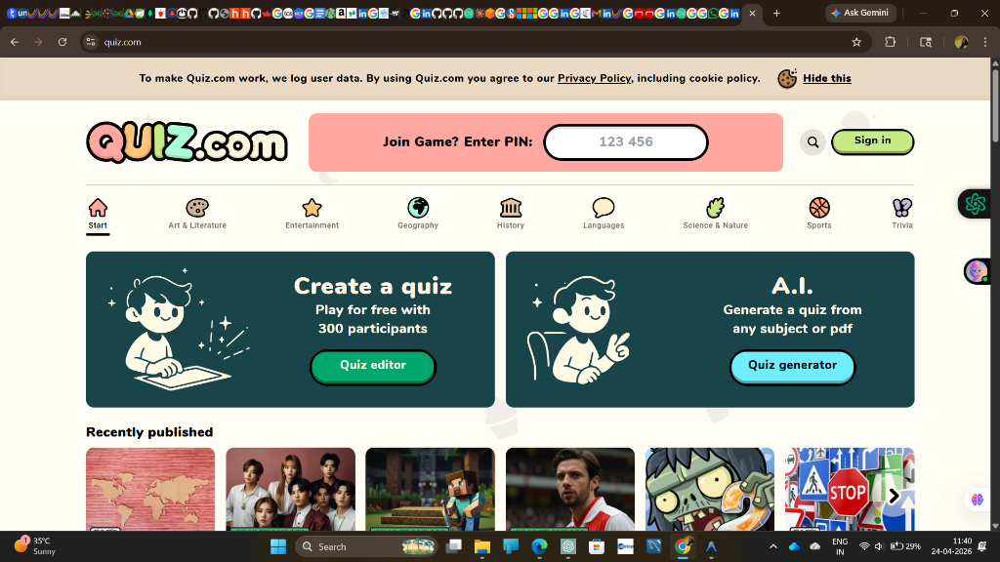

# 🧠 BrainVault - Master Your Knowledge

BrainVault is a modern, interactive, and visually stunning Quiz Application built with **Angular**. It features a playful "bubbly" design system, a massive library of 180+ questions across 9 categories, and a cutting-edge **Magic AI Quiz Generator**.



## 🚀 Key Features

- **🎯 9 Dynamic Categories**: Explore quizzes in General Knowledge, Art & Lit, Entertainment, Geography, History, Languages, Science, Sports, and Trivia.
- **📚 Massive Question Bank**: Over 180+ handcrafted questions (20 per category) to challenge your intellect.
- **🪄 Magic AI Generator**: Type any topic and watch as our "AI" (simulation) generates a full 20-question custom quiz just for you.
- **🎨 Premium Bubbly UI**: A unique Indigo & Lavender theme with smooth animations, high-quality Unsplash imagery, and a responsive grid layout.
- **📊 Result Analytics**: Detailed score breakdown with percentage and personalized performance feedback.
- **💾 History Tracking**: Keep track of your previous quiz attempts and scores.
- **🏗️ Quiz Creator**: Built-in editor to build and share your own custom challenges.

## 🛠️ Tech Stack

- **Framework**: [Angular](https://angular.io/) (v17+ Standalone Components)
- **Language**: TypeScript
- **Styling**: Vanilla CSS3 (Custom Design System)
- **Icons**: FontAwesome 6
- **Fonts**: Fredoka (Google Fonts)
- **Assets**: Dynamic Unsplash API Integration

## ⚙️ Local Development

1. **Clone the repository**:
   ```bash
   git clone https://github.com/Meeramirsha/quiz-app.git
   cd quiz-app-angular
   ```

2. **Install dependencies**:
   ```bash
   npm install
   ```

3. **Run the development server**:
   ```bash
   npm start
   ```
   Navigate to `http://localhost:4200/`. The app will automatically reload if you change any of the source files.

## 🌐 Deployment

The project is optimized for deployment on **Vercel**. 

- **Routing**: Includes `vercel.json` for seamless client-side routing.
- **Build Command**: `ng build`
- **Output Directory**: `dist/quiz-app-angular/browser`

## 📄 License

This project is open-source and available under the [MIT License](LICENSE).

---
*Created with ❤️ by Meera*
